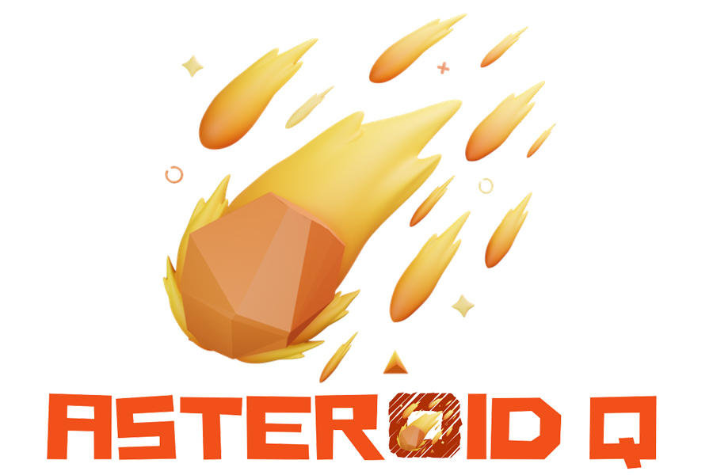

<br>
<div align="center">

<p align="center">Strategic 2D Asteroid Hunter Game</p>
</div>

## About Asteroid Q

Asteroid Q is a 2D asteroid hunting board game inspired by the classic arcade shooter, 1942.

The game's universe is represented by a Cartesian plane, where each coordinate denotes a distinct galaxy within a vast, procedurally generated universe.

The objective is to destroy 100 asteroids using a jet fighter as efficiently as possible.

This cross-platform game, built using the popular [Flutter](https://flutter.dev) framework, was developed with the assistance of [Amazon Q Developer](https://aws.amazon.com/q/developer/), demonstrating the efficiency of AI-powered coding tools.

## Get Started

Before getting started, you need to set up a few things:

1. **Encryption Key and Initialization Vector:** Generate these using the [encrypt](https://pub.dev/packages/encrypt)
   package. These are essential for secure data storage.

2. **JSON Configuration File:** You'll need a JSON file to configure the game. We've stored our configuration in Cloudflare R2 Object Storage and provided an example URL.

You can find example files and further instructions in the [cloudflare](cloudflare/config.example.json) and [env](env/env.example.json) directories.

You will also have to set up the backend involves using the Amplify CLI to configure authentication and the leaderboard REST API. Here's a breakdown:

1. **DynamoDB Tables:** You'll need three DynamoDB tables (one for each device category: desktop, tablet, and mobile).

2. **Lambda Functions:** Each table requires two Lambda function paths:
   * One to retrieve the entire leaderboard (e.g., `/desktop`).
   * Another to fetch a specific player's entry (e.g., `/desktop/{player}`).

3. **Table Structure:**  Each DynamoDB table has the following columns:

   | Column     | Data Type |
   |------------|-----------|
   | `player`   | String    |
   | `distance` | Number    |
   | `rotate`   | Number    |
   | `refuel`   | Number    |
   | `galaxy`   | Number    |
   | `timestamp`| Number    |

   The `player` column serves as the partition key for each table."

The Asteroid Q game in this repository was developed using `Flutter version 3.27.1` and `Dart version 3.6.0`

## Clone, Run, Build

1. Clone the repository:
    ```dart
    git clone https://github.com/hasToDev/asteroid_q.git
    ```

2. Install all the project dependencies:
   ```dart
   flutter pub get
   ```

3. Run on local browser (**web-port** is optional between 0-65535):
   ```dart
   flutter run --dart-define-from-file=env/env.example.json --web-renderer canvaskit -d web-server --web-port 7777
   ```

4. Generate the release build for web app:
   ```dart
   flutter clean
   flutter pub get
   flutter build web --dart-define-from-file=env/env.example.json --release
   ```

## License

The **Asteroid Q** is distributed under an MIT license. See the [LICENSE](LICENSE) for more information.

[](https://opensource.org/licenses/MIT)

## Contact

[Hasto](https://github.com/hasToDev) - [@HasToDev](https://twitter.com/HasToDev)